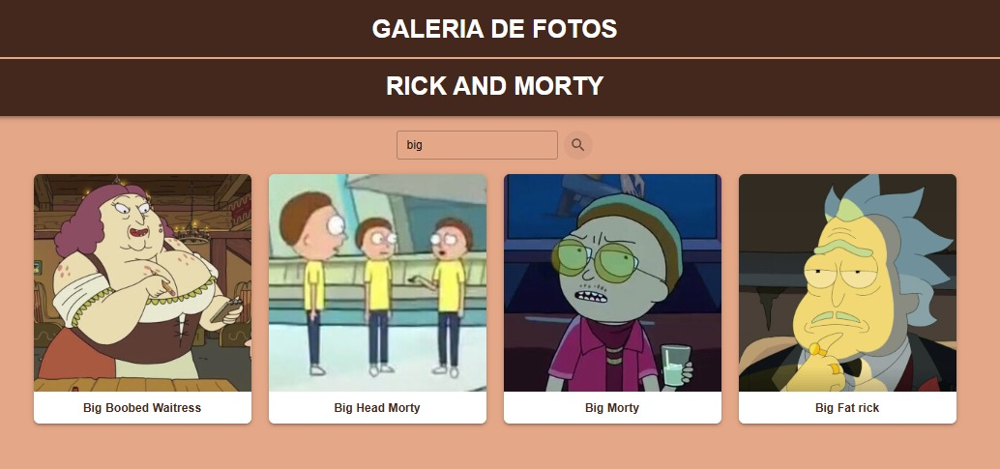

# Galeria de Fotos do Rick and Morty

 

     

É uma aplicação web desenvolvida em **React com TypeScript**, utilizando **Material-UI** e criada com **Vite**. O projeto foi elaborado como parte da seleção para a Aceleradora Ágil - PUCRS. O objetivo da aplicação é exibir uma galeria de fotos, na qual escolhi apresentar personagens da série Rick and Morty. A aplicação conta com funcionalidades como busca ao clicar no botão (optei por essa abordagem devido à ambiguidade na descrição do problema, que não especificava se a busca deveria ocorrer enquanto se digita ou apenas com o clique), paginação e efeitos visuais interativos.

---

## Badges

---

## Índice

- [Descrição do Projeto](#descrição-do-projeto)
- [Funcionalidades e Demonstração da Aplicação](#funcionalidades-e-demonstração-da-aplicação)
- [Acesso ao Projeto](#acesso-ao-projeto)
- [Tecnologias Utilizadas](#tecnologias-utilizadas)
- [Pessoas Desenvolvedoras do Projeto](#pessoas-desenvolvedoras-do-projeto)

---

## Descrição do Projeto

A **Galeria de Fotos** é uma aplicação web criada para exibir imagens dos personagens da série *Rick and Morty*. Desenvolvida com **React** e **TypeScript**, ela permite ao usuário buscar personagens por nome, navegar entre diferentes páginas de resultados e visualizar as imagens em um layout responsivo e interativo. A aplicação utiliza **Material-UI** para os componentes e **Vite** para otimizar o desenvolvimento.

---

## Funcionalidades e Demonstração da Aplicação

### Funcionalidades

- **Galeria de Fotos**: Exibição de fotos de personagens organizadas em um grid responsivo.
- **Barra de Busca**: Permite a busca de personagens por nome, com filtragem ao clicar no botão.
- **Efeitos Visuais**: Interação com destaque ao passar o mouse sobre as fotos.
- **Responsividade**: Totalmente adaptada para diferentes tamanhos de telas, garantindo uma boa experiência em dispositivos móveis e desktops.

### Demonstração da Aplicação
A aplicação exibe fotos de personagens da série *Rick and Morty*, e a pesquisa filtra os resultados com base no nome do personagem.
- **Barra de busca**

     

- **Interatividade**

     

- **Paginação**

     

---

## Acesso ao Projeto

Você pode acessar a aplicação rodando localmente, siga os passos abaixo.

### Como Rodar Localmente

1. **Clonar o repositório**:

    
bash
    git clone https://github.com/seu-usuario/galeria-fotos.git

2. **Instalar as dependências**:

    - Usando npm:

    
bash
    npm install

    - Usando yarn:

    
bash
    yarn install

3. **Rodar a aplicação**:

    - Usando npm:

    
bash
    npm start

    - Usando yarn:

    
bash
    yarn start

Isso abrirá a aplicação no navegador em http://localhost:3000.

---

## Tecnologias Utilizadas

- **React** com **TypeScript**: Biblioteca para o desenvolvimento da interface com tipagem estática.
- **Vite**: Ferramenta para inicializar e rodar o projeto de forma rápida e eficiente.
- **Material-UI (MUI)**: Biblioteca de componentes responsivos e estilos modernos.
- **Fetch API**: Para interação com a API e carregamento dos dados.
- **CSS**: Usado para customização e responsividade do layout.

---

## Pessoas Desenvolvedoras do Projeto

- **[Franciele Tadiello](https://github.com/FranTadiello)** 

---

## Contato

Para mais informações, dúvidas ou sugestões, entre em contato:

- **Email**: franciele.p.t@gmail.com
- **LinkedIn**: [https://www.linkedin.com/in/franciele-pereira-tadiello-007a2b165/](https://www.linkedin.com/in/franciele-pereira-tadiello-007a2b165/)
